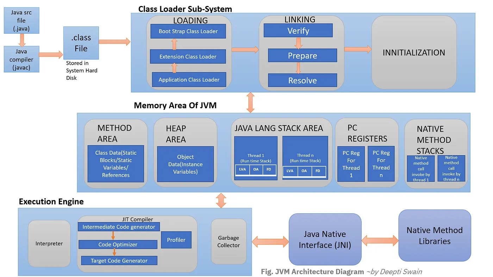

  

    목차
  

    {: .no_toc .text-delta }

1. TOC
{:toc}

  

  > 
  출처: [Medium](https://interviewnoodle.com/jvm-architecture-71fd37e7826e) ([by Deepti Swain](https://deeptiswain.medium.com/))

# JDK
Java 언어로 작성된 코드의 컴파일, 디버깅, 문서화, 패키징 도구를 포함한 형태

간단하게 설명하면 `JRE` + `Development Tool`로 볼 수 있다.

- 정의
   - 자바를 실행하기 위한 개발 도구 모음

- 사용 이유
   - 빠르고 안정적인 개발이 가능
      - 표준화
        - 다른 환경에서 발생하는 문제의 가능성을 낮추며, 공통된 용어 및 도구 사용
      - 일관성
        - 라이브러리 버젼 및 자바의 버젼의 일관성

## Development Tool 
아래와 같은 Tool을 제공한다.
 - java 
    - 컴파일된 프로그램 실행
 - javac
    - .java의 파일을 바이트 코드인 .class 파일로 변환
 - javadoc
    - 주석을 기반으로 API 문서 생성 
 - jdb
    - 실행중인 자바를 단계별로 분석 및 디버깅
 - javap, jdeps 
    - 클래스 파일의 구조 분석 및 의존성 확인
 - jmap
    - Heap Dump
    - stop-the-world 발생
 - jstack
    - Thread Dump
 - jstat
    - JVM Information

## JRE
 Java를 실행하기 위한 환경
  - 간단하게 설명하면 `JVM`, `Class Library`로 볼 수 있다.

### JVM
JAVA 바이트 코드(.class)를 실행하는 가상 머신

- Class Loader를 통하여 JVM에 클래스 파일이 적재된다.
- GC(Garbage Collcetor)를 통하여 메모리 관리

### Class Library

--------------------
# 번외
 - Java는 컴파일 언어인가? 인터프리터 언어인가?
   - 둘다이다.
   - 기본적으로 인터프리터 언어이나, 자주 실행하는 코드의 경우 JVM의 JIT를 통하여 컴파일로 실행하게 된다.
 -  `Write Once, Run Anywhere`를 가능하게 하는 것은?
    - javac를 통하여 .java를 .class 파일로 변환 하는 것
    - JVM에서 Class 파일을 실행하는 것 