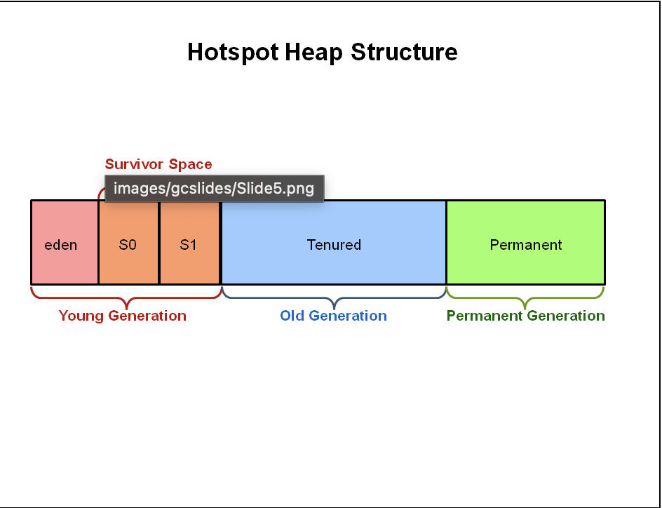

  

    목차
  

  {: .no_toc .text-delta }

1. TOC
{:toc}

  > 
  출처: [Medium](https://interviewnoodle.com/jvm-architecture-71fd37e7826e) ([by Deepti Swain](https://deeptiswain.medium.com/))

# JDK

Java 언어로 작성된 코드의 컴파일, 디버깅, 문서화, 패키징 도구를 포함한 형태

간단하게 설명하면 `JRE` + `Development Tool`로 볼 수 있다.

-   정의
    -   자바를 실행하기 위한 개발 도구 모음
-   사용 이유  
    -   표준화
        -   다른 환경에서 발생하는 문제의 가능성을 낮추며, 공통된 용어 및 도구 사용
    -   일관성
        -   라이브러리 버젼 및 자바의 버젼의 일관성

## Development Tool

아래와 같은 Tool을 제공한다.

-   java
    -   컴파일된 프로그램 실행
-   javac
    -   .java의 파일을 바이트 코드인 .class 파일로 변환
-   javadoc
    -   주석을 기반으로 API 문서 생성
-   jdb
    -   실행중인 자바를 단계별로 분석 및 디버깅
-   javap, jdeps
    -   클래스 파일의 구조 분석 및 의존성 확인
-   jmap
    -   Heap Dump
    -   stop-the-world 발생 가능성 있음
-   jstack
    -   Thread Dump
-   jstat
    -   JVM Information

## JRE

Java를 실행하기 위한 환경

-   간단하게 설명하면 JVM, Class Library로 볼 수 있다.

### JVM

JAVA 바이트 코드(.class)를 실행하는 가상 머신

-   Class Loader를 통하여 JVM에 클래스 파일이 적재된다.
-   GC(Garbage Collcetor)를 통하여 메모리 관리
    -   메모리 누수에 대한 관리 포인트 감소 (C/C++ 대비)

### JVM Memory Area

Method Araea + Heap + Stack + PC Register + Native Method Stack

#### Method Area

-   JVM 시작 시 생성 됨
-   논리적으로는 힙의 일부 
    -   버젼에 따라 힙의 일부로 구현(과거 PermGen, Java 7), 또는 네이티브 메모리에 할당(Java 8+의 Metaspace)
-   JVM에서 공유가 가능
-   OS에서의 Text Segment와 유사 (실행 대상 code, instructions 보관 영역)
-   런타임 상수 풀
-   필드 및 메서드 데이터
-   메서드 및 메서드의 생성자 코드
-   클래스/인터페이스/인스턴스 초기화에 사용되는 특수 메서드

#### Heap 

-   JVM 시작 시 생성 됨
-   JVM에서 공유가 가능하며, 런타임 데이터 영역을 저장
    -   클래스 인스턴스 및 배열을 할당 (new 키워드)
    -   GC에 의하여 관리
    -   초기/최소/최대 크기의 제어 가능

 출처: [GC tutorior](https://www.oracle.com/webfolder/technetwork/tutorials/obe/java/gc01/index.html)

-   메모리 구조 
    -   Young Generation: 새로 생성된 객체가 처음 할당되는 공간
        -   해당 영역이 가득차게 되면 Minor GC가 발생한다.
            -   Minor GC는 stop-the-world Event를 발생한다.
        -   Eden Space: 새로 생성된 객체가 처음 할당되는 공간
        -   Survivor Space: Eden Space에서 살아남은 객체가 이동되는 공간, 일반적으로 2개의 Survivor 영역이 번갈아서 사용됨(S0, S1)
            -   S0, S1이 번갈아서 사용되는 이유는 메모리 재정렬을 위하여.
    -   Old Gneration: Young 세대 객체에서 특정 Age에 도달하면 이동
        -   GC가 발생하며 해당 GC를 Major GC가 발생
            -   stop-the-world Event 발생
        -   Major GC
            -   모든 살아있는 객체 검사하기에 Minor GC 보다 느리다.
            -   일시 중단 시간은 GC 종류에 따라 달라진다.
    -   Permanent Generation
        -   Java 8부터는 제거되었으며, MetaSpace로 대체되며 Native Memory에 존재
            -   Native Memory에 존재하기에 OS가 관리.

#### Stack (per-thread)

-   각 Thread 마다 고유하게 생성.
-   기본(원시)형 변수의 값과 메서드 실행 정보 등이 저장되는 영역
    -   메서드의 매개변수
    -   지역 변수
    -   연산 도중 발생하는 임시 값
    -   리턴 값
    -   예외 처리 및 제어 흐름 정보
-   참조형 변수의 경우 참조(주소) 값이 저장된다.
-   메서드가 종료되면 해당 Stack Frame이 제거된다.
-   LIFO의 자료구조의 Stack과 동일한 특성이 가진다.

#### PC Register (per-thread)

-   각 Thread 마다 고유하게 생성
-   JVM 명령어 "주소"를 저장
-   실행 흐름 기록장치 (CPU 상에서의 PC와 유사.)

#### Native Method Stack (per-thread)

-   각 Thread 마다 고유하게 생성
-   C, C++, 어셈블리 등 다른 언어로 작성된 네이티브 코드를 실행하기 위하여 사용되는 스택 메모리 영역
    -   하드웨어, 운영체제에 밀접한 기능을 사용할 때 필요한 네이티브 코드 라이브러리
    -   JNI(Java Native Interface)를 통해 자바 코드에서 네이티브 메서드를 호출하며 네이티브 메서드 스택 영역이 사용됨.

### JIT(Just In Time) 컴파일러

-   JDK 1.2에 등장
-   바이트 코드에서 Native Code(기계어)로 컴파일 하는 주체
    -   자주 실행되는 바이트 코드를 기계어로 Caching 하여 실행 속도를 개선
-   JIT 컴파일 단위는 메서드이다.
-   JIT 대상은 컴파일 임계치에 도달할 경우 JIT 컴파일 대상이 된다.
    -   즉 런타임 시 최적화를 진행하게 되며 이를 "프로파일 기반 최적화(PGO)"라고 칭한다.
    -   임계치는 JAVA 버젼 및 C1, C2에 따라 상이하다.

### Class Loading

-   클래스 로더를 통하여 메서드 영역에 로드함을 의미
    -   로드하는 과정은 3가지 sub-step으로 구성되어있다.

1.  Loading
    -   .class(바이트코드) 파일을 읽어와 메모리에(Method Area) 적재
2.  Linking
    -   Class, Interface에 대한 검증, 준비 과정
    -   Verifying, Preparing, Resolving 세단계로 나눠서 진행됨 
        -   Verifying
            -   문법, 타입, 접근 제한 검증
        -   Preparing
            -   static 필드를 담을 메모리를 할당하며, 기본 값으로 초기화
                -   int : 0, String: null 처럼 기본 값으로 초기화
                -   코드상 설정한 값은 3.Initialization 에서 진행
        -   Resolution
            -   심볼릭 레퍼런스를 실제 메모리 주소로(다이렉트 레퍼런스) 변환
                -   변수 명이 아닌 메모리 상의 주소 값으로 변환
3.  Initialization
    -   static 변수들의 실제 정의된 값으로 초기화
    -   static 블럭 수행

# 번외

-   Java는 컴파일 언어인가? 인터프리터 언어인가?
    -   둘다이다.
    -   자바는 소스 코드를 바이트 코드로 컴파일한 후, JVM이 이를 실행할 때 인터프리터나 JIT 컴파일을 사용한다.
        -   기본적으로 인터프리터 언어이나, 자주 실행하는 코드의 경우 JVM의 JIT를 통하여 컴파일로 실행하게 된다.
-   thread-safe 란 무슨 의미를 가질까?
    -   동시에 여러 Thread에서 초기화 및 참조가 되지 않는다.
        -   Stack, PC, Native Method Stack의 경우 1개의 Thread 마다 서로 다른 Thread에서 생성되기에 참조 및 초기화 할 수 없다.
-   Write Once, Run Anywhere를 가능하게 하는 것은?   
    -   바이트코드(.class), JVM에서 Class 파일을 실행하는 것
        -   OS 별 네이티브 코드가 아닌 바이트코드를 통하여 OS 상관없이 실행 가능.
-   stop-the-world 란?
    -   GC 발생 시 모든 Application Thread가 일시 정지됨을 의미한다.
-   JIT의 결과는 어디에 저장되나?
    -   Code Cache에 저장된다.
        -   Code Cache는 JIT 결과 뿐만 아닌 인터프리터 관련 코드, JVM 자체 네이티브 코드도 동시 저장
-   리터럴 값은 메서드 영역에 저장되나?
    -   일부는 맞고 일부는 틀린 이야기.
        -   과거 PernGen 시절에는 맞는 이야기
        -   최신 자바 버젼에서는 리터럴 값은 런타임 상수 풀에 저장된다. (JAVA JDK 1.8+)
            -   단, 문자열 리터럴의 경우 객체 주소를 런타임 상수 풀에 저장하고 실제 값은 String Constant Pool에 저장하게 된다.
            -   또한 실행 시에는 스택 프레임 변수에 복사되어 사용되게 된다.
        

Ref.

자바 성능 튜닝 / 스캇 오크스 저자

[https://docs.oracle.com/en/java/javase/11/vm/java-hotspot-virtual-machine-performance-enhancements.html](https://docs.oracle.com/en/java/javase/11/vm/java-hotspot-virtual-machine-performance-enhancements.html)

[https://docs.oracle.com/javase/specs/jvms/se21/html/jvms-2.html#jvms-2.5](https://docs.oracle.com/javase/specs/jvms/se21/html/jvms-2.html#jvms-2.5)

[https://www.oracle.com/webfolder/technetwork/tutorials/obe/java/gc01/index.html](https://www.oracle.com/webfolder/technetwork/tutorials/obe/java/gc01/index.html)